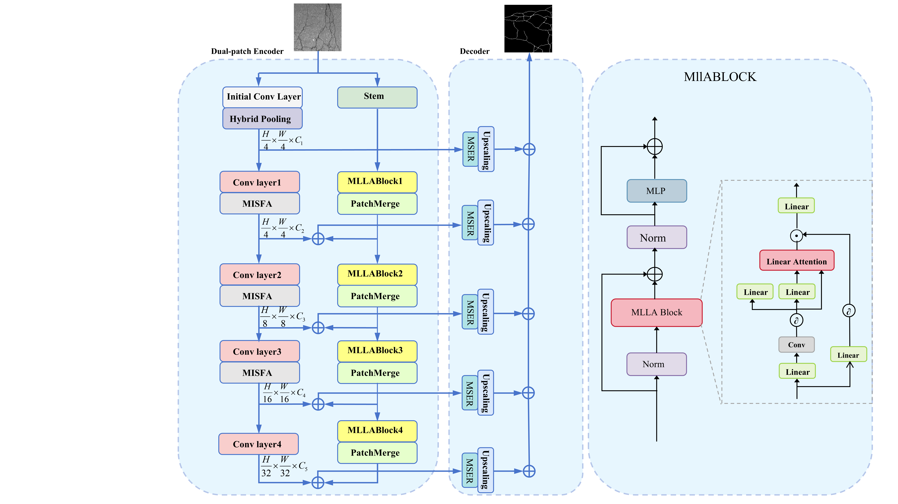

# DFT-CrackNet: Enhanced Crack Segmentation via Dual-Branch CNN-Transformer Architecture with Linear Perception and Multi-Scale Refinement

This repository contains the code for the paper **“Enhanced Crack Segmentation via Dual-Branch CNN-Transformer Architecture with Linear Perception and Multi-Scale Refinement”**, which has been submitted to *The Visual Computer*.

## 1. Method Overview

<p align="center">
    
</p>

Crack segmentation is crucial for infrastructure maintenance and structural health monitoring. Traditional image processing techniques are limited by their inability to capture complex crack geometries and contextual continuity. Although deep learning, particularly Convolutional Neural Networks (CNNs), has advanced crack detection, these methods struggle with long-range dependencies and detailed shape capture.

To address these challenges, we introduce **DFT-CrackNet**, a dual-branch encoder-decoder architecture integrating CNN and Transformer models. Our approach enhances feature extraction at multiple scales using Hybrid-Pooling and a learnable Linear Perception Guidance Mechanism (LPFM), which accentuates linear crack structures while minimizing background interference. A Multi-Scale Edge Refinement module further improves fine crack edge detection.

Trained on the **CrackVision12K** dataset and extended to include fine crack data from tunnels (**CrackVision12K-fine**), **DFT-CrackNet** outperforms existing models in complex scenarios, achieving superior F1-score (82.0%), IoU (69.7%), and Recall (80.9%) on the **CrackVision12K** dataset. It also maintains leading performance on the **CrackVision12K-fine** dataset with an F1-score of 80.9% and mIoU of 68.2%.

This model demonstrates its effectiveness in accurately segmenting cracks, particularly in fine-grained and low-contrast environments, with significant potential for real-world infrastructure maintenance applications.

## 2. Getting Started

### 2.1 Setup Environment

Before starting training, set up your environment by installing the necessary dependencies from the `requirements.txt` file. You can do this within an existing virtual environment using the following command:
```
pip install -r requirements.txt
```
This ensures that all required libraries and frameworks are properly installed.

### 2.2 Dataset Description

This project uses the following datasets, stored in the `datasets` directory:

- **CrackVersion12K**: A dataset with various crack types for general detection tasks.
- **CrackVersion-Fine**: An extension of **CrackVersion12K**, adding annotations for finer cracks (e.g., microcracks) for high-precision segmentation.

#### Dataset Download

Both datasets can be directly downloaded from the links below:

- [CrackVersion12K Dataset](https://github.com/li5jing/DFT-CrackNet/datasets/crackversion12k)
- [CrackVersion-Fine Dataset](https://github.com/li5jing/DFT-CrackNet/datasets/crackversion12k-fine)

### 2.3 Model Training

Training of pixel-level crack detection models can be initiated with:
```
python trainer.py
```

The training outcomes, including trained weights, training process, and achieved metrics, will be saved in the "logs" directory.

<p align="center">
    
</p>

Weights will be saved in the directory specified by the argument, defaulting to `--output_dir SCP-Control-Output`.

### 2.4 Model Prediction

To visualize crack detection results with a trained model, execute the following command:
```
python test.py
```
You can also follow the steps below to validate the results of our experiments on the **CrackVersion12K** and **CrackVersion-Fine** datasets:

- **Download Checkpoint**: Get the pre-trained model on the **CrackVersion12K** dataset: [checkpoint_crackversion12k](https://drive.google.com/file/d/1aK7DgKbMQwK/view?usp=drive_link)
- **Download Checkpoint**: Get the pre-trained model on the **CrackVersion-Fine** dataset: [checkpoint_crackversion12k-fine](https://drive.google.com/file/d/1aK7DgtZlK/view?usp=drive_link)

#### File Placement

Move the downloaded checkpoint file to the designated path: `./checkpoints/weights/checkpoint/`

## 3. Visualization

Below is a visual comparison of typical cracks detected across four datasets using 10 different methods.

<p align="center">
    
</p>

## 4. Citation

If you find our work or any of our materials useful, please cite our paper:
```
@misc{,
      title={Enhanced Crack Segmentation via Dual-Branch CNN-Transformer Architecture with Linear Perception and Multi-Scale Refinement}, 
      author={JiangTao Feng and Jing Li and FengLei Su and ChengJun Duan and XuDong Shui},
      year={2025},
      eprint={},
      archivePrefix={arXiv},
      primaryClass={cs.CV},
      url={}, 
}
```

## 5. Contact

For any issues regarding this dataset or code, please contact **ChengJun Duan** at [chengjund1218@163.com](mailto:chengjund1218@163.com)


